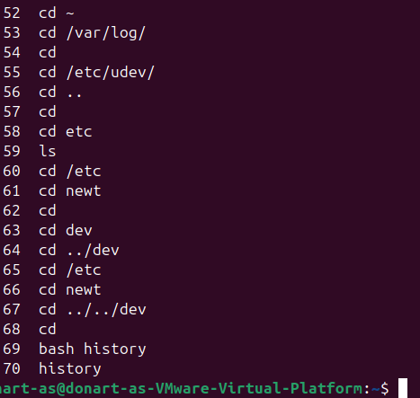
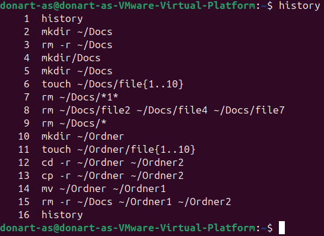

# Modul_122
## Checkpoint Linux Befehle

### Übung 1 - Repetition: Navigieren in Verzeichnissen

- cd ~

- cd /var/log

- cd /etc/udev/

- cd ..

- cd newt

- cd ../../dev

### Übung 2 - Wildcards

- mkdir ~/Docs

- touch ~/Docs/file{1..10}

- rm ~/Docs/*1*

- rm ~/Docs/file2 ~/Docs/file4 ~/Docs/file7

- rm ~/Docs/*

- mkdir ~/Ordner

- touch ~/Ordner/file{1..10}

- cp -r ~/Ordner ~/Ordner2

- cp -r ~/Ordner ~/Ordner2/Ordner3

- mv ~/Ordner ~/Ordner1

- rm -r ~/Docs ~/Ordner1 ~/Ordner2

### Übung 3 - grep, cut (, awk)

a: 

- grep --color=auto 'obelix' ~/textfile.txt

- grep --color=auto '2' ~/textfile.txt

- grep --color=auto 'e' ~/textfile.txt

- grep --color=auto -v 'gamma' ~/textfile.txt

- grep --color=auto -E '1|2|3' ~/textfile.txt

b:

- cut -d ':' -f 1 ~/textfile.txt

- cut -d ':' -f 2 ~/textfile.txt

- cut -d ':' -f 3 ~/textfile.txt

### Übung 5 - stdout, stdin, stderr

a Textdatei mit cat und <<

- cat << END > buchstaben.txt
a
b
c
d
e
END

b:

- sudo ls -z 2> /root/errorsLs.log

c:

1.  echo "Das ist eine Testzeile." > test.txt
2. Umleiten mit einem >:  cat test.txt > ausgabe.txt
 cat ausgabe.txt    Es überschreibt die Datei
3. cat test.txt >> ausgabe.txt
Dies tut die Datei zur anderen Datei anhängen
4. cat test.txt > test.txt : die Datei wird vor dem Lesen überschrieben und bleibt deswegen leer oder beschädigt

d: 

- whoami > info.txt

e:

- id >> info.txt

f:

wc -w < info.txt

# Variablen

Bearbeite diesen Code
BIRTHDATE="Jan 1, 2000"
Presents=10
BIRTHDAY=$(date -d "$BIRTHDATE" +%A)

Testcode

if [ "$BIRTHDATE" == "Jan 1, 2000" ] ; then
    echo "BIRTHDATE ist korrekt, es ist $BIRTHDATE"
else
    echo "BIRTHDATE ist nicht korrekt"
fi
if [ $Presents == 10 ] ; then
    echo "Ich habe $Presents Geschenke bekommen."
else
    echo "Presents ist nicht korrekt"
fi
if [ "$BIRTHDAY" == "Saturday" ]||[ "$BIRTHDAY" == "Samstag" ] ; then
    echo "Ich wurde an einem $BIRTHDAY geboren."
else
    echo "BIRTHDAY ist nicht korrekt"
fi

# Verzweigung

#!/bin/bash

DATEI="daten.txt"

# Prüfen, ob die Datei existiert
if [ ! -e "$DATEI" ]; then
  echo "[FEHLER] Datei nicht vorhanden."
elif [ ! -r "$DATEI" ]; then
  echo "[WARNUNG] Datei existiert, aber ist nicht lesbar."
else
  # Wortanzahl in der Datei ermitteln
  WORTANZAHL=$(wc -w < "$DATEI")

  if [ "$WORTANZAHL" -lt 20 ]; then
    echo "[HINWEIS] Datei ist sehr klein."
  elif [ "$WORTANZAHL" -le 100 ]; then
    echo "[OK] Datei hat akzeptable Grösse."
  else
    echo "[ACHTUNG] Datei ist ungewöhnlich gross."
  fi
fi

# Schleifen

## Aufgabe 1

#!/bin/bash

NUMBERS=(951 402 984 651 360 69 408 319 601 485 980 507 725 547 544 615 83 165 141 501 263 617 865 575 219 39>
echo "Zahlen größer als 400:"
for zahl in "${NUMBERS[@]}"; do
  if [ "$zahl" -gt 400 ]; then
    echo "$zahl"
  fi
done

## Aufgabe 2

#!/bin/bash

echo "Jede zweite IP-Adresse von 192.168.10.50 bis 192.168.10.70:"
for ((i=50; i<=70; i+=2)); do
  echo "192.168.10.$i"
done

